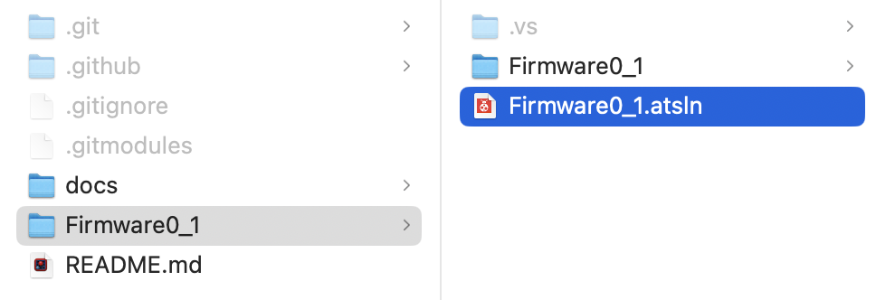

# IoT

## Interface

Max payload size is at 20 bytes excluding the header.
Without the header it is at 14 bytes.

Total of 14 bytes can be sent up or back at once.
Currently using 3.

| Type        | Description | Position    | Size        |
| ----------- | ----------- | ----------- | ----------- |
| Float       | Temperature | 0           | 1 byte      |
| Float       | CO2         | 1           | 1 byte      |
| Float       | Humidity    | 2           | 1 byte      |

## Setup

When setting up the project it is crucial that one initialises the submodules after cloning the project.

### 1
```git
git clone https://github.com/SW-SEP4-S23/IoT.git
```
### 1
```git
git submodule init
```
### 2
```git
git submodule update
```

These steps must be gone through **before** opening the software in **Atmel Studio 7**.

## Atmel studio

To open the project, all ready for programming, in atmel studio, choose the .atsln project file as shown in the picture below.



